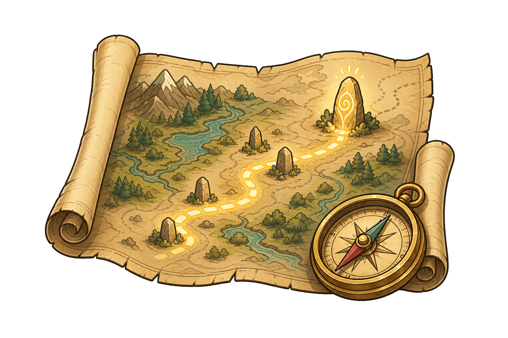

<p align="center">
  
</p>

<h1 align="center">Questline</h1>

<p align="center">
  <em>Moves your project forward one clear, achievable result at a time. Discuss, implement, verify, repeat.</em>
</p>

## How it works

1. Invoke `/questline` with the description of the goal you want to advance. The agent uses a matching Questline or starts one for a new goal.
2. Agree with the agent on what to tackle next and roughly how much it should cover. Once you confirm it as the next Waypoint, the agent creates a marked draft and updates it as you work through the important decisions. When the draft is ready, the agent asks you to approve it.
3. Ask the agent to implement the approved Waypoint. When using Codex, Goal mode is recommended for keeping longer implementation runs attached to it. If implementation reveals that the Waypoint needs to change, the agent revises it with you and waits for approval before continuing.
4. Repeat for the next Waypoint. When you stop pursuing the goal, remove its folder or preserve it elsewhere; every folder left in `.questline/` is active.

## Installation

Just ask Codex or Claude Code to install this skill from the repository, or run:

```sh
npx skills add adiachenko/questline --global
```

## Concepts

### Questline

A Questline is one active, scoped software goal. Its directory under `.questline/` contains a Compass and a numbered sequence of Waypoints. A project can pursue several goals at once, with one Questline per goal:

```text
.questline/
├── message-delivery/
│   ├── compass.md
│   ├── 001_publish_through_rabbitmq.md
│   └── 002_receive_into_laravel_queues.md
└── billing-reliability/
    ├── compass.md
    └── 001_surface_reconciliation_failures.md
```

### Waypoint

A Waypoint starts as a marked draft for the next piece of work you agree to tackle. The agent updates it as you make decisions together. Once you approve it, the Waypoint guides the implementation and keeps a record of what you agreed.

### Compass

Each Questline's `compass.md` records its goal and the long-term direction that should carry across Waypoints. The agent updates it when that direction changes and uses it to keep later Waypoints aligned and catch conflicts with other active Questlines. Decisions that matter only to the current Waypoint stay in that Waypoint. You do not edit or approve the Compass separately; if its direction needs to change, the agent discusses that change with you first.

## Pitfalls

- **Deciding too early.** Defer decisions the current Waypoint does not depend on; record when to revisit one only if that prevents premature commitment.
- **Turning `.questline/` into a backlog.** Create a Questline only for work you intend to pursue now, and clean it up when you stop pursuing it.
- **Assuming active Questlines are independent.** The agent surfaces conflicts automatically; you decide how competing priorities or decisions that affect more than one goal should be reconciled.
- **Letting a Waypoint grow.** Keep it focused on one bounded deliverable. Save adjacent features and follow-up work for the next Waypoint rather than expanding the current one.
